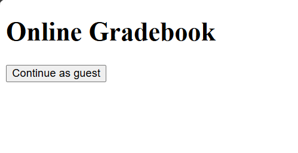
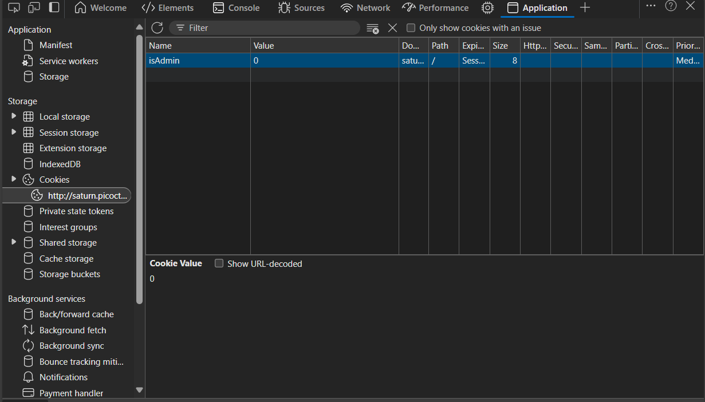

# Write-up : Power Cookie
---
### Description :
> Can you get the flag?
> Additional details will be available after launching your challenge instance.
### Hint : 
> Do you know how to modify cookies?
---
### Solution :
- Từ hint của bài ta biết rằng việc của chúng ta là thay đổi cookies
- Sau khi vào trang web thì ta thấy có 1 phần giống như đăng nhập với tư cách `` guest ``
  
- Chúng ta sau khi bấm vào `` Continue as guest `` thì xuất hiện dòng chữ `` We apologize, but we have no guest services at the moment. ``

Sau khi đăng nhập với tư cách `` guest `` và tìm trong source thì không thấy gì nhưng ở phần `` cookie `` trong phần `` application `` thì có xuất hiện :

> Có thể đây là cookie xác minh người đăng nhập có phải là admin hay không là hiện tại giá trị của cookie đó là 0 nghĩa là không phải.

Ta thay đổi giá trị của cookie isAdmin thành `` 1 `` để bên phía sever nhận dạng chúng ta là `` admin `` .
Sau khi reset lại trang thì ta nhận được flag.
### Flag : `` picoCTF{gr4d3_A_c00k13_65fd1e1a} `` 
