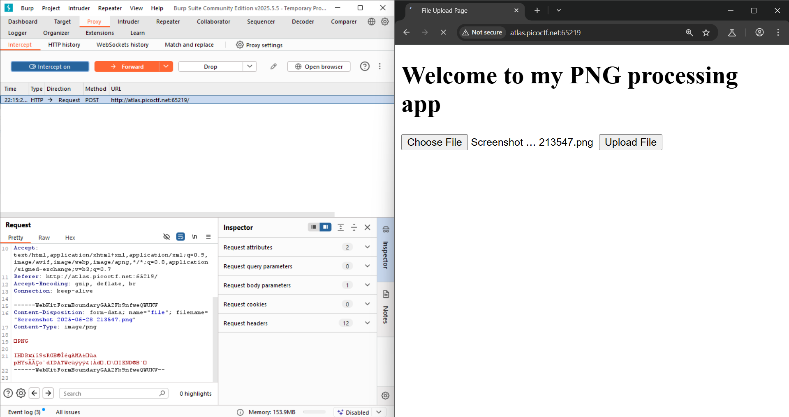
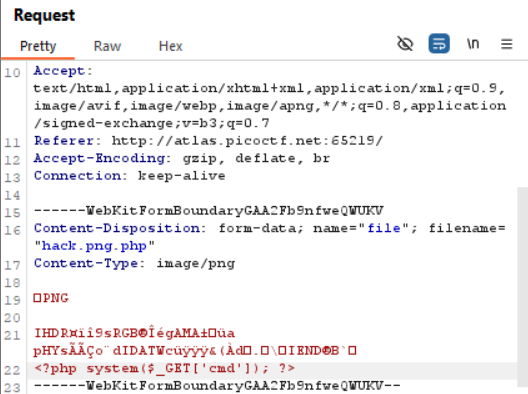
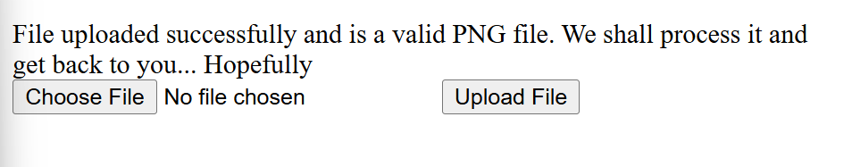
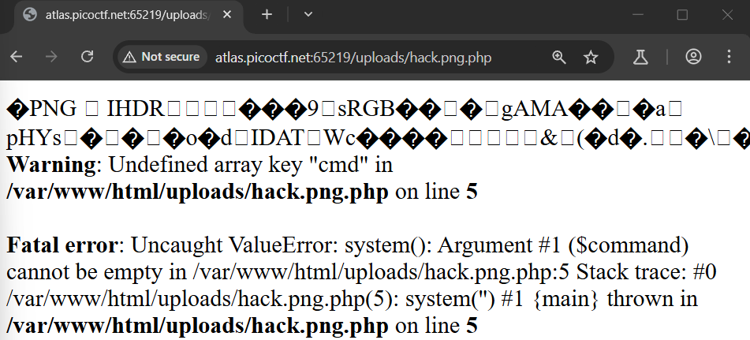
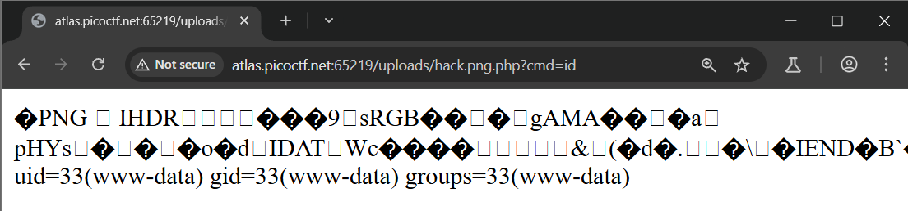
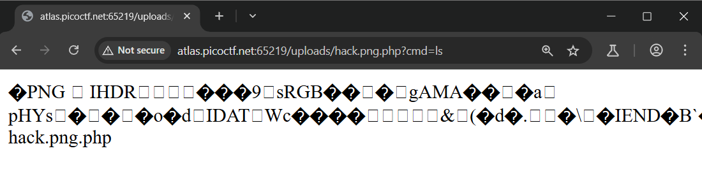
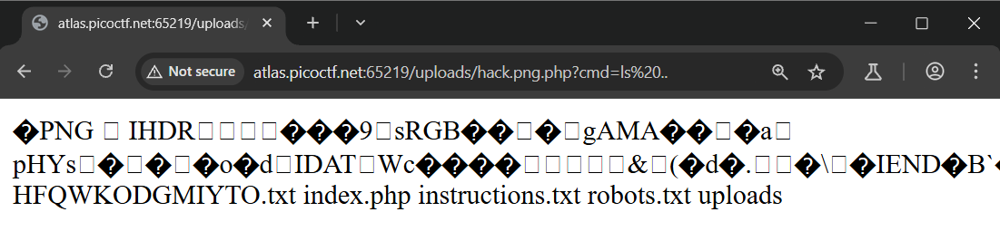
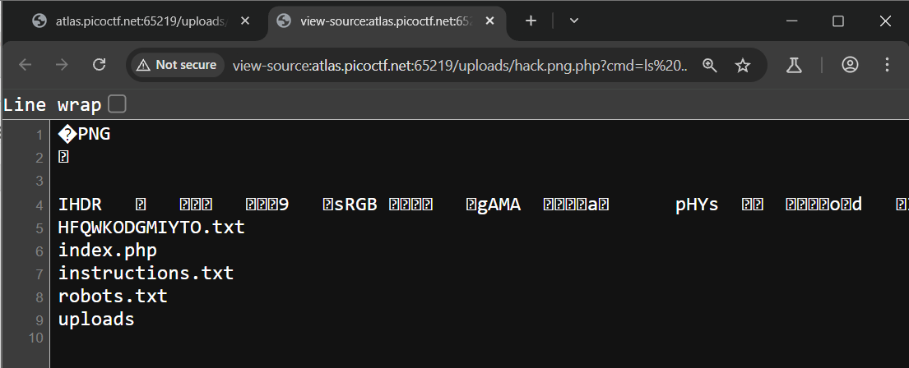
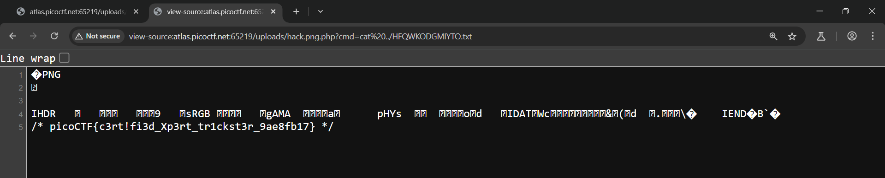

# Write-up : Trickster
---
### Description : 
> I found a web app that can help process images: PNG images only!
> Additional details will be available after launching your challenge instance.
### Hint :
> none
---
### Solution :
- Sau khi mở bài lên thì chúng ta thấy 1 form để upload file
- Upload thử 1 file .png thì hoàn toàn thành công

Vậy chúng ta đảm bảo rằng việc web hoạt động đúng và không có vấn đề gì khi upload file, ngoài ra chúng ta cũng chưa biết nếu upload thành công thì sẽ mở file đó như nào.
> dùng ``dirsearch`` để tìm các file có thể truy cập : ``  dirsearch -u "http://atlas.picoctf.net:65219/" -e *
 `` kết quả nhận lại được là : 
```bash
[10:56:35] Starting: 
[10:56:50] 403 -  285B  - /.ht_wsr.txt                                      
[10:56:50] 403 -  285B  - /.htaccess.bak1                                   
[10:56:50] 403 -  285B  - /.htaccess.sample                                 
[10:56:50] 403 -  285B  - /.htaccess.orig
[10:56:50] 403 -  285B  - /.htaccess_extra                                  
[10:56:50] 403 -  285B  - /.htaccess.save                                   
[10:56:50] 403 -  285B  - /.htaccess_orig
[10:56:50] 403 -  285B  - /.htaccess_sc
[10:56:50] 403 -  285B  - /.htaccessBAK
[10:56:50] 403 -  285B  - /.htaccessOLD
[10:56:50] 403 -  285B  - /.htaccessOLD2
[10:56:50] 403 -  285B  - /.htm                                             
[10:56:50] 403 -  285B  - /.html
[10:56:50] 403 -  285B  - /.htpasswd_test
[10:56:50] 403 -  285B  - /.htpasswds
[10:56:50] 403 -  285B  - /.httr-oauth                                      
[10:58:48] 200 -   62B  - /robots.txt                                        
[10:58:50] 403 -  285B  - /server-status/                                    
[10:58:50] 403 -  285B  - /server-status
[10:59:07] 301 -  333B  - /uploads  ->  http://atlas.picoctf.net:65219/uploads/
[10:59:07] 403 -  285B  - /uploads/ 
```
Chúng ta thấy rằng có thể truy cập vào `` /robots.txt ``, sau khi truy cập thì ta nhận được thông tin :
```
 User-agent: *
Disallow: /instructions.txt
Disallow: /uploads/
```
Truy cập vào đường dẫn `` /instructions.txt `` thì nhận được thêm thông tin : 

```
Let's create a web app for PNG Images processing.
It needs to:
Allow users to upload PNG images
	look for ".png" extension in the submitted files
	make sure the magic bytes match (not sure what this is exactly but wikipedia says that the first few bytes contain 'PNG' in hexadecimal: "50 4E 47" )
after validation, store the uploaded files so that the admin can retrieve them later and do the necessary processing.
```
> Yêu cầu của đoạn thông tin này là yêu cầu đuôi file phải là `` .png `` cùng với đó là kiểm tra `` magic bytes ``
> Vậy chúng ta phải cố gắng vượt qua được 2 filter này của bài.
> - Với filter đầu tiên : chúng ta có thể nối thêm đuôi file, ví dụ : `` image.png.php `` sau khi chạy thì sẽ kiểm tra và sau khi kiểm tra thấy `` .png `` thì sẽ chấp nhận
> - Với filter thứ 2 : ta hoàn toàn không thể thay đổi nội dung của file vì sẽ thay đổi `` magic bytes ``, nhưng hãy nhớ rằng sau khi chúng ta thay đổi tên file thì sever sẽ dùng ngôn ngữ phù hợp với đuôi file để đọc file. Chúng ta đã đổi thành `` .php `` nên sever sẽ dùng `` PHP `` để đọc file này
> - Điều đó sẽ khiến các code `` PHP `` trong file sẽ được thực thi vì thế chúng ta sẽ thêm đoạn code `` PHP `` vào 1 vị trí nào đó trong file ảnh, mà cụ thể là cuối vì sẽ ít gây ra xung đột.

Bắt đầu công cuộc tấn công :
- Dùng `` burp suite `` để chặn request và thực hiện các bước tấn công.
- Dùng 1 file ảnh có kích thước nhỏ để upload.
- Sau khi chặn request ngay sau khi upload ảnh đó.
- 
- Thay đổi tên và đuôi của file ( để dễ tìm kiếm file và bypass qua filter đầu ), tiếp theo là thêm code PHP vào cuối file ảnh.
- 
- Sau khi forward thì upload file thành công.
- 
- Chúng ta sẽ truy cập vào file đó để thực thi code trong file, truy cập với đường dẫn `` http://atlas.picoctf.net:65219/uploads/hack.png.php ``
- 
- Tiếp tục là thử các lệnh để xem code có hoạt động ( thử với lệnh `` ls `` và `` id `` )
- 
- 
- Sau khi thử với lệnh `` ls `` thì hoàn toàn không thấy 1 file nào lạ hay file `` flag.txt ``. Vậy chúng ta sẽ kiểm tra các file ở trên 1 cấp ( thư mục cha ) với lệnh `` ls .. ``
- 
- 
- > giải thích : `` ls .. `` là xem các file ở trên 1 cấp với
- Phát hiện 1 file khá lạ đó là : `` HFQWKODGMIYTO.txt ``
- Dùng lệnh `` cat `` để đọc với câu lệnh hoàn chỉnh là : `` cat ../HFQWKODGMIYTO.txt ``
- > vì file `` HFQWKODGMIYTO.txt `` ở trên chúng ta 1 cấp nên phải dùng `` ../ ``
- 

Đánh giá : bài này khá hay nếu chấm cho bài này thì là 8/10 có kết hợp giữa upload, magic bytes và lệnh linux
### Flag : `` picoCTF{c3rt!fi3d_Xp3rt_tr1ckst3r_9ae8fb17} ``
