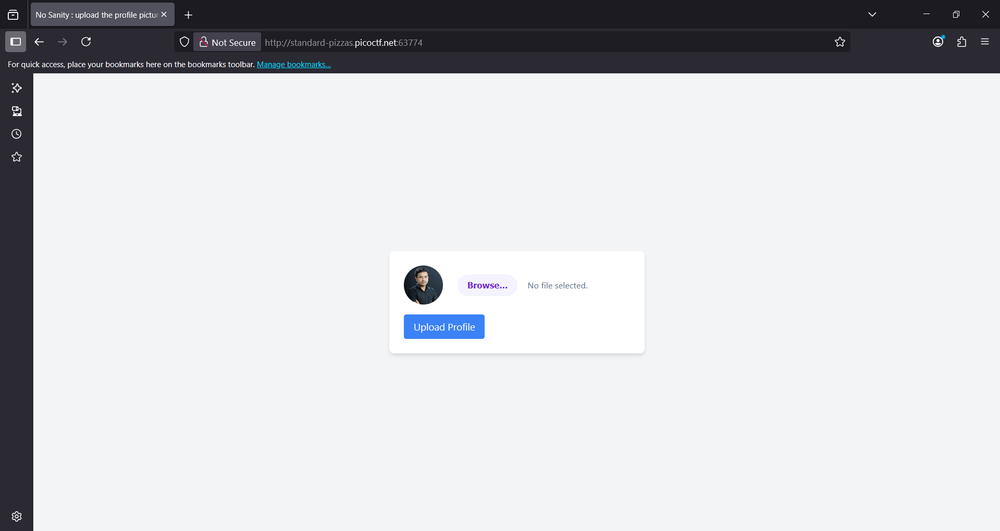
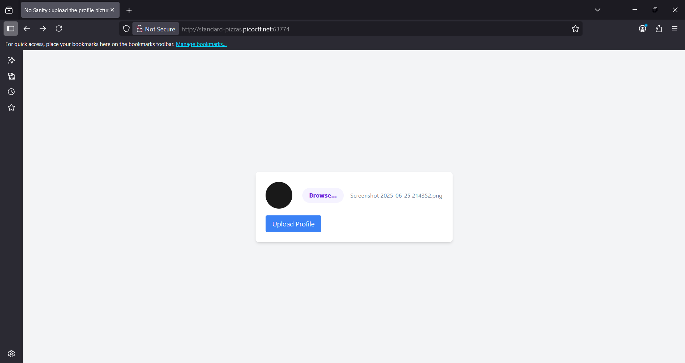
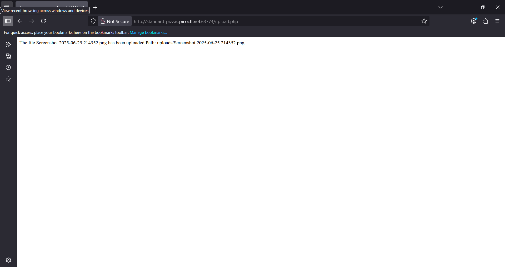

# 🧠 Challenge: n0s4n1ty 1

---

## 📝 **Description**

> A developer has added profile picture upload functionality to a website. However, the implementation is flawed, and it presents an opportunity for you. Your mission, should you choose to accept it, is to navigate to the provided web page and locate the file upload area. Your ultimate goal is to find the hidden flag located in the `/root` directory.

---

## 💡 **Hint**

- `File upload was not sanitized`
- `Whenever you get a shell on a remote machine, check sudo -l`

---

## 🔍 **Initial Analysis**

Khi khởi động challenge, người dùng được cung cấp một giao diện web với chức năng **tải ảnh đại diện**.

Kiểm tra mã JavaScript phía frontend:

```javascript
var loadFile = function(event) {
    var input = event.target;
    var file = input.files[0];
    var type = file.type;
    var output = document.getElementById('preview_img');

    output.src = URL.createObjectURL(event.target.files[0]);
    output.onload = function() {
        URL.revokeObjectURL(output.src); // free memory
    }
};
```
Đây chỉ là mã preview ảnh, không có cơ chế lọc nội dung file upload, cho thấy khả năng tồn tại lỗ hổng unsanitized file upload.
Kiểm tra sever và web có hoạt động ổn định bằng việc upload thử 1 file ảnh có dung lượng nhỏ:


